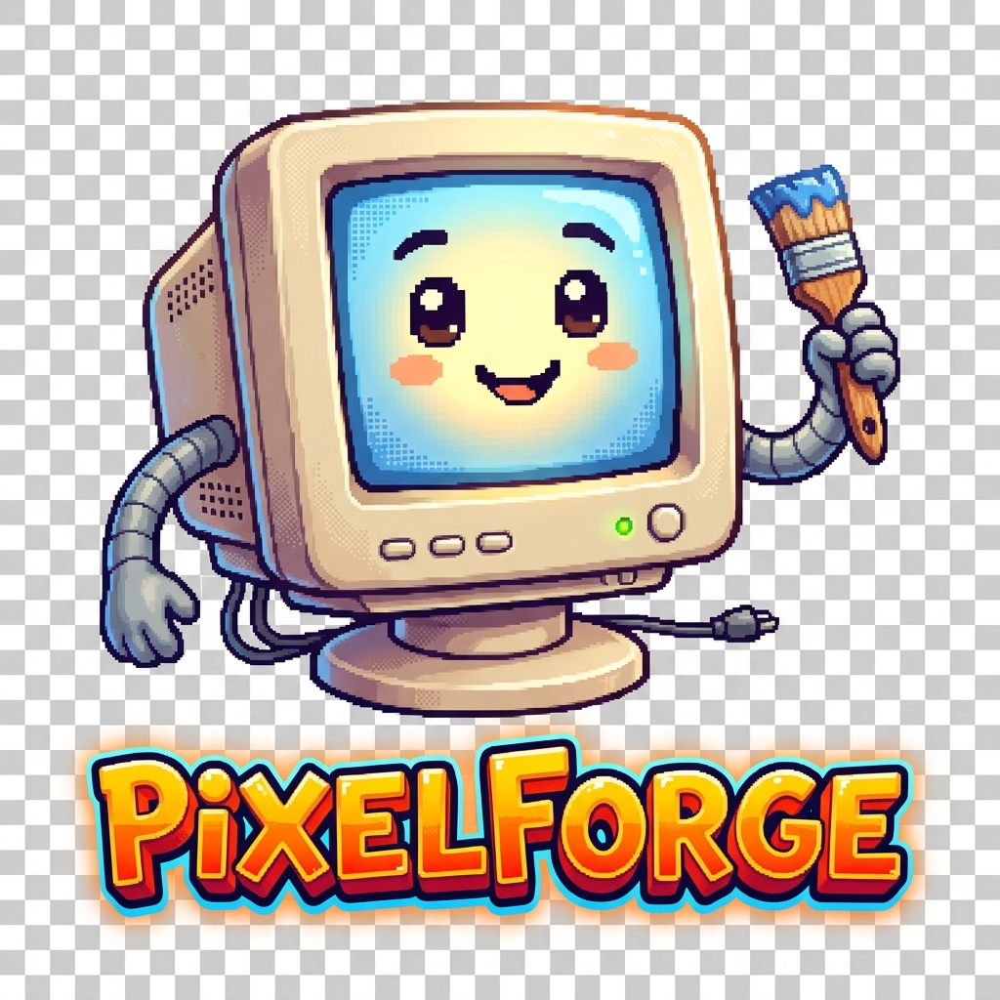

#  PixelForge

**The ultimate 2D powerhouse for pixel art, animated sprites, and game assets.**

[](https://github.com/Subhan-Haider/PixelForge/actions/workflows/build.yml)
[](https://hosted.weblate.org/engage/pixelforge/)
[](https://discord.gg/Yb2CeX8)

## 🎨 Forge Your Imagination

**PixelForge** isn't just another image editor; it's a dedicated workspace built for the specific needs of pixel artists and game developers. Our philosophy is simple: **Maximum Pixel Precision.**

Whether you are crafting high-frame-rate animations for an indie RPG, designing icons for a modern UI, or building procedural textures, PixelForge provides the retro-styled, highly efficient tools you need to stay in flow and produce professional results.

### ✨ What Makes Us Different?

While other tools focus on general illustration, PixelForge was built from the ground up for **low-fidelity, high-impact** art. We believe that constraints drive creativity, and our toolset is designed to help you master those constraints with speed and grace.

---

## 🚀 Key Features Breakdown

### ⏳ Advanced Timeline & Animation
PixelForge treats animation as a first-class citizen. Manage complex sequences with separated [layers and frames](https://www.pixelforge.org/docs/timeline/).
*   **Onion Skinning**: Visualize previous and next frames for smooth transitions.
*   **Live Preview**: See your sprite in motion in a dedicated window while you draw.
*   **Batch Frame Management**: Transform, delete, or move multiple frames simultaneously.

### 🖌️ Specialized Pixel Drawing Tools
Our brush engine is fine-tuned for the pixel grid.
*   **Pixel Perfect Freehand**: No more messy "double pixels" on your curves.
*   **Custom Brushes**: Save any selection as a brush to stamp or paint with complex patterns.
*   **Shading & Ink Modes**: Professional shading tools that respect your palette's ramp.
*   **Dithering**: Support for various dithering matrices for that perfect retro look.

### 🌈 Palette & Color Management
Master your colors with industry-standard modes and management.
*   **Indexed Mode**: Precise palette control (up to 256 colors per file).
*   **RGBA Support**: Modern Alpha transparency for high-fidelity assets.
*   **Grayscale**: Perfect for mask generation and simplified lighting.

### 🔄 Tiled Mode (Seamless Patterns)
Create world textures and repeating patterns with absolute ease. Tiled mode lets you see the repetition in real-time as you draw, ensuring every seam is invisible.

---

## 🤖 Power User & Automation

### ⌨️ Command Line Interface (CLI)
PixelForge can be integrated into your automated build pipelines. Save time by automating repetitive export tasks.
*   **Batch Processing**: Convert entire folders of assets in seconds.
*   **Spritesheet Generation**: Use `--sheet-columns` and `--data` to generate ready-to-use game engine textures.
*   **Layer Filtering**: Export specific layers or groups using `--layer` tags.

### 🧩 Scripting Engine (Lua)
Extend functionality with our powerful Lua 5.4 scripting environment.
*   **Custom UI**: Build your own dialogs and tools using the `app.dialog` API.
*   **Asset Processing**: Write scripts to batch-process millions of pixels or create procedural art.
*   **Community Plugins**: Download and install extensions created by the community.

---

## 🏗️ Architecture & Technical Specs

PixelForge is built on a high-performance C++17 stack designed for near-zero latency and rock-solid stability.

| Specification | Details |
| :--- | :--- |
| **Language** | Modern C++17 |
| **Graphics Engine** | Skia / Hardware-backed rendering (Vulkan/OpenGL) |
| **UI Framework** | [laf](https://github.com/dacap/laf) (Libre App Framework) |
| **Scripting** | Lua 5.4 Embedded Engine |
| **Undo/Redo** | Infinite non-linear history (RAM permitting) |
| **Max Canvas** | Limited only by available system memory |

---

## 📥 Getting Started

Ready to forge your first pixel? Here’s how to start:

1.  **Download**: Get the latest stable release for [Windows, macOS, or Linux](https://www.pixelforge.org/download/).
2.  **Launch**: Open the executable (look for our monitor mascot icon).
3.  **Learn**: Check out the [official documentation](https://www.pixelforge.org/docs/) to master advanced hotkeys.
4.  **Customize**: Explore the `data/extensions` folder to tweak themes and palettes.

---

## 🛠️ Building from Source

For developers who want to contribute to the engine, PixelForge follows a standard modern CMake workflow.

### Prerequisites
*   **C++17 Compiler** (GCC 7+, Clang 5+, or MSVC 2019+)
*   **CMake 3.16+**
*   **Skia Graphics Library**
*   **Ninja Build System** (Recommended)

### Quick Start Build
```bash
# Clone the project
git clone --recursive https://github.com/Subhan-Haider/PixelForge.git
cd PixelForge

# Configure and compile
mkdir build && cd build
cmake .. -G "Ninja" -DCMAKE_BUILD_TYPE=RelWithDebInfo
ninja pixelforge
```
Check our [Full Build Guide](INSTALL.md) for platform-specific details.

---

## 🤝 Join the Forge

Connect with other artists and developers:
*   **Developer Discord**: [Join our community](https://discord.gg/Yb2CeX8)
*   **Technical Discussions**: [GitHub Discussions](https://github.com/Subhan-Haider/PixelForge/discussions)
*   **Follow the Journey**: [Twitter/X](https://twitter.com/pixelforge) | [Instagram](https://instagram.com/pixelforge)

## 📜 License & Acknowledgments

PixelForge is a derivative work built on the excellent foundation of the original **Aseprite**, created by [David Capello](https://davidcapello.com/) and [Igara Studio](https://igara.com/). We are deeply grateful for their years of innovation in the pixel art space.

© 2025 PixelForge Contributors. Distributed under the [PixelForge EULA](EULA.txt).
Original Aseprite source code is (C) 2001-2024 David Capello.

---
*Forged with 💖 for artists everywhere. Every pixel counts.*

